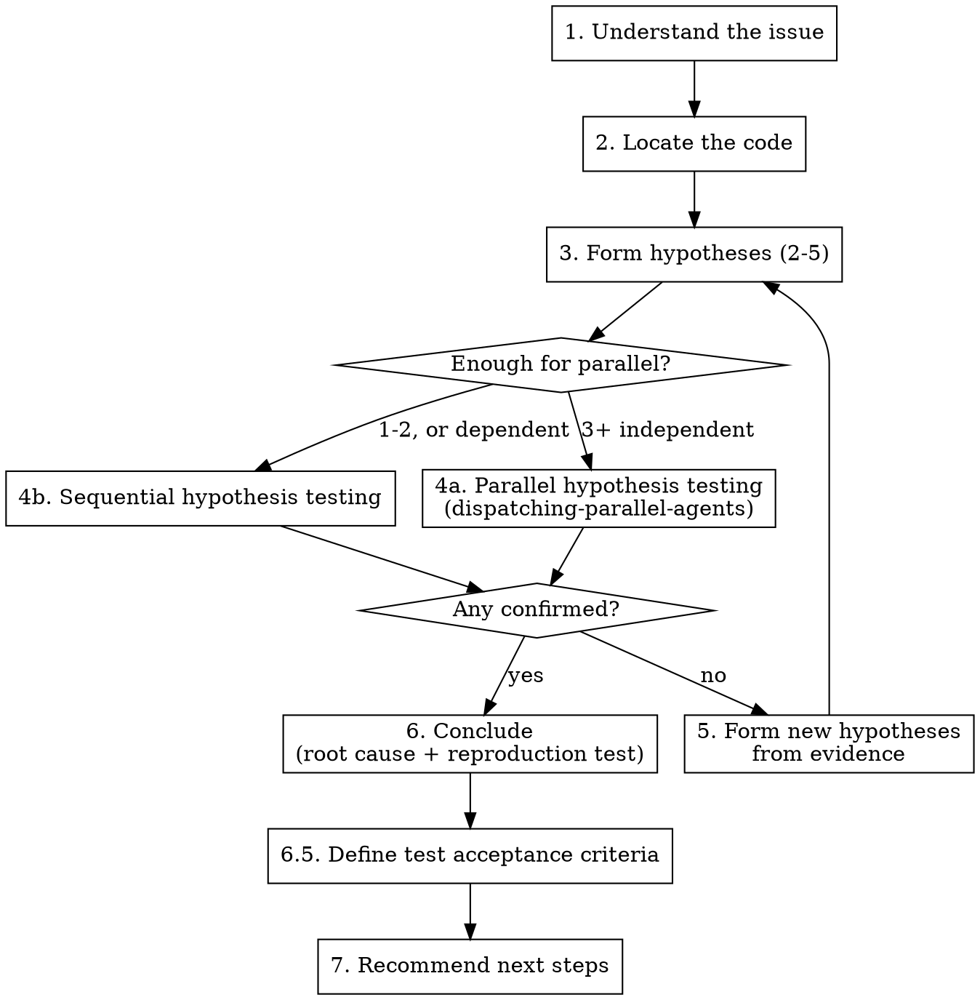

# Bug Triage

## Overview

Triage is investigation, not summarization. The deliverable is a confirmed root cause with specific code locations and a reproduction test that proves it.

**Core principle:** No fix without a confirmed root cause. No root cause without evidence.

**Announce at start:** "I'm using the bug-triage skill to investigate this issue."

## When to Use

- Bug report (GitHub issue, conversation, error log)
- Unexpected behavior reported by a user or test failure
- Regression after a change
- Any time the question is "why is this broken?"

**Do not use for:**
- Feature requests (use `brainstorming`)
- Known root cause ready to fix (use `bug-fix`)
- Performance investigation without a specific symptom (use `systematic-debugging` directly)

## Prerequisites

Read these before starting:
- **superpowers:evidence-driven-testing** — the testing discipline used throughout triage
- **superpowers:handler-authority** — how to weigh handler input (loop/async mode)
- **superpowers:systematic-debugging** — the broader 4-phase technique this workflow builds on
- Project-specific triage context (`.claude/shared/triage-project.md` if it exists)

## The Process



### Step 1: Understand the Issue

- Load issue details (GitHub CLI, conversation context, error logs)
- Read relevant project docs and architecture
- Identify the user-facing symptom
- Note any handler suggestions — investigate them but don't assume they're correct (see `handler-authority`)

**If starting from a GitHub issue:**
```bash
gh issue view <issue#> --repo <owner/repo> --json title,body,url,number,comments,assignee
```

### Step 2: Locate the Code

Trace the symptom to specific files and functions. Produce file paths and line numbers, not module names.

- Read the actual code, don't guess from file names
- Trace from the user-facing symptom inward
- For test failures: identify which gate failed and read the error output
- Consult project-specific tracing guidance (`.claude/shared/triage-project.md`) for language-specific paths

### Step 3: Form Hypotheses

Produce 2-5 specific hypotheses. Each MUST include:
- What you think the root cause is
- Specific file(s) and line number(s)
- Expected vs actual behavior at that location
- What a test would show if this hypothesis is correct

If a handler suggested a direction, include it as a hypothesis but verify independently.

### Step 4: Test Hypotheses

**Decide: parallel or sequential.**

#### 4a: Parallel Hypothesis Testing (3+ independent hypotheses)

Uses `dispatching-parallel-agents` to investigate concurrently:

1. **Dispatch one subagent per hypothesis.** Each subagent gets:
   - The specific hypothesis: "Root cause is X in file Y at line Z because..."
   - The `evidence-driven-testing` discipline at scratch commitment level
   - Narrow scope: investigate ONLY this hypothesis
   - Project-specific test paths and commands (from `.claude/shared/triage-project.md`)
   - Required output format:
     ```
     Hypothesis: <restate>
     Status: CONFIRMED | DISPROVEN
     Test written: <file path>
     Test result: <pass/fail + output summary>
     Evidence: <what the test proved/disproved>
     ```

2. **Subagents work in parallel:**
   - Write a scratch test for their hypothesis (using `evidence-driven-testing`)
   - Run it, confirm it fails for the right reason (or passes unexpectedly)
   - Report back with evidence

3. **Coordinator collects results:**
   - Hypothesis confirmed: that subagent's test is the reproduction evidence
   - Hypothesis disproven: note the evidence, discard the hypothesis
   - No hypothesis confirmed: go to Step 5

**Independence requirement:** Hypotheses must be investigatable without results from other hypotheses. If hypotheses are dependent ("if A is true then B might be the deeper cause"), investigate A first, then B sequentially.

**Conflict avoidance:** If subagents would edit the same test files or build artifacts, use sequential instead.

#### 4b: Sequential Hypothesis Testing (1-2 hypotheses, or dependent)

Test one hypothesis at a time using `evidence-driven-testing` at scratch commitment level:
1. Write a test for the hypothesis
2. Run it, confirm it fails for the right reason
3. If confirmed: proceed to Step 6
4. If disproven: move to next hypothesis

### Step 5: No Hypothesis Confirmed

All hypotheses were disproven. This is progress, not failure — you now know what the root cause ISN'T.

- Review the evidence from disproven hypotheses
- What did the tests reveal about actual behavior?
- Form new hypotheses based on this new understanding
- Return to Step 3

**After 2 rounds with no confirmation:** Reassess fundamentals. Are you looking in the right area? Is the symptom description accurate? Consider using `systematic-debugging` Phase 1 from scratch.

### Step 6: Conclude

State the root cause with:
- **Confidence level:** High / Medium / Low
- **Specific location:** File(s), line number(s), function(s)
- **Reproduction evidence:** The confirmed test — what it tests, how it fails, why that proves the root cause
- **What the fix should change** (scope, not implementation details)

If confidence is below Medium: state what additional investigation is needed.

### Step 6.5: Define Test Acceptance Criteria

Output explicit test acceptance criteria that `/fix` and `/test` will use:

**Test Acceptance Criteria:**
- **Reproduction test:** `[file path]`
  - **Validates:** [What behavior this test confirms]
  - **Pass condition:** [Specific expected outcome when bug is fixed]
  - **Commitment level:** Promoted (this test will be kept permanently)

- **Additional testing required:**
  - [ ] Unit tests: [Which test suites must pass]
  - [ ] Integration tests: [If applicable, what integrations to verify]
  - [ ] Regression tests: [Specific scenarios that must not break]
  - [ ] Manual verification: [If needed, what user-facing behavior to check]

- **Gates to run:**
  - [ ] Linting (if code changes)
  - [ ] Type checking (if applicable)
  - [ ] Full test suite in affected area
  - [ ] [Project-specific gates from `.claude/shared/test-project.md`]

This checklist becomes the definition of "done" for the fix.

### Step 7: Recommend Next Steps

Based on test acceptance criteria from Step 6.5:

- **For simple fixes:** Recommend `/fix <issue#>`
  - The `bug-fix` skill will use the reproduction test and acceptance criteria
  - Expected workflow: promote test → confirm RED → fix → confirm GREEN → run gates

- **For complex fixes:** Recommend `/write-plan <issue#>` then `/execute-plan`
  - Complex = multi-file architecture changes, requires design decisions
  - The plan should reference the test acceptance criteria

- **Suggest branch name:** `fix/<issue#>-short-description`

- **Reference test criteria:** Point to the checklist from Step 6.5 — this is what "done" means

**Next command to run:** `/fix <issue#>` or `/write-plan <issue#>`

## Modes

### Interactive Mode
- Ask questions directly in chat
- Wait for user input when needed
- Present findings with specific file paths and line numbers

### Loop Mode (Async)
- All questions via GitHub issue comments (see `handler-authority`)
- Post `[TRIAGE_QUESTION]` marker when input is needed from handler
- Post `[TRIAGE_READY]` marker when triage is complete with confirmed root cause
- Never block on terminal input — post comment and move to next item

## Branch Checkpoint

Triage often starts on the default branch before an issue or branch exists. When investigation reaches a point where files need to be created (test artifacts):

- **If issue number provided:** create branch immediately (`fix/<issue#>-short-description`)
- **If no issue number:** pause, present findings so far, suggest creating a GitHub issue, ask user to approve. Once approved: create issue, create branch, continue triage on the branch.

## Anti-Patterns

| Pattern | Problem |
|---------|---------|
| Summarizing the issue description and calling it triage | Triage is investigation, not paraphrasing |
| "The issue is likely in X" without reading the code | Locate means READ, not guess |
| Hypotheses without file paths and line references | Vague hypotheses can't be tested |
| Confirming hypotheses by reasoning instead of running code | Evidence means execution, not logic |
| Anchoring to first hypothesis when evidence points elsewhere | Drop disproven hypotheses completely |
| Treating handler suggestions as confirmed facts | Investigate independently, then compare |
| Proposing a fix before completing triage | Root cause first, fix second |

## Red Flags — STOP

- Proposing fixes before Step 6
- Skipping hypothesis testing ("the root cause is obviously X")
- Not writing a test to confirm the hypothesis
- Proceeding with Medium or Low confidence without flagging it
- Ignoring disproven evidence to keep a preferred hypothesis

**All of these mean: return to the process. No shortcuts.**

## Integration

**Uses:**
- **superpowers:evidence-driven-testing** — scratch commitment level for hypothesis tests
- **superpowers:dispatching-parallel-agents** — parallel hypothesis investigation
- **superpowers:systematic-debugging** — broader 4-phase technique
- **superpowers:handler-authority** — async handler communication

**Followed by:**
- **superpowers:bug-fix** — for simple fixes (receives triage conclusion + reproduction test)
- **superpowers:writing-plans** — for complex fixes requiring an implementation plan
